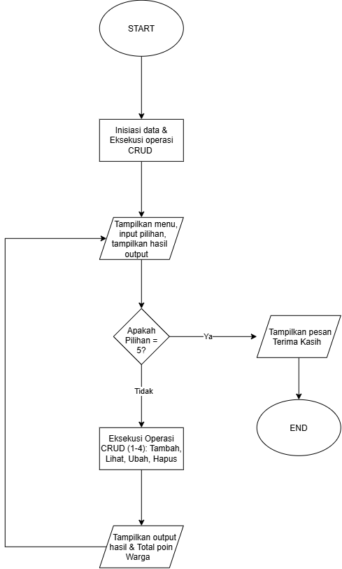
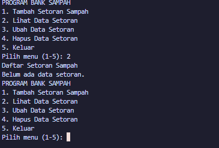
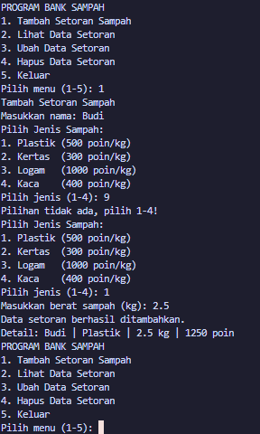
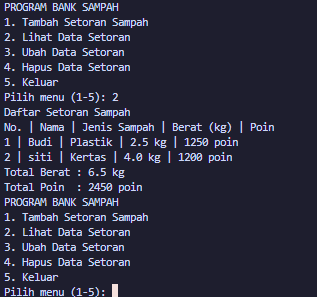
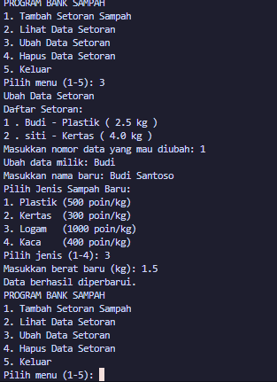
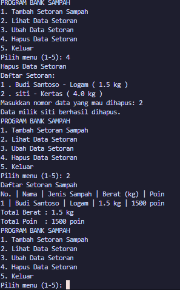
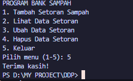

# Tugas Praktikum DDP - Sistem Pengelolaan Bank Sampah

**Identitas Mahasiswa:**
- **Nama** : M. Fairuz Firerza Aliushami
- **NIM**  : 2609116062
- **Tema** : Sistem Pengelolaan Bank Sampah dan Konversi Poin Warga

---

## Deskripsi Program

Program ini dibuat untuk mencatat dan mengelola setoran sampah dari warga serta mengonversinya menjadi poin secara otomatis. Program berjalan secara berulang menggunakan menu berbasis teks (terminal) dan menerapkan konsep dasar pemrograman seperti variabel, tipe data List dan Tuple, percabangan (`if-elif-else`), serta perulangan (`while` dan `for`).

Program ini sudah memiliki fitur CRUD lengkap:
1. **Create**: Menambahkan data setoran sampah baru.
2. **Read**: Menampilkan seluruh data setoran yang tersimpan dan menghitung total akumulasi berat serta poin.
3. **Update**: Mengubah data setoran yang sudah ada jika ada kesalahan.
4. **Delete**: Menghapus data setoran dari daftar.

---

## Penjelasan Struktur Kode Program

1. **Struktur Data (List & Tuple)**
   - `data_setoran = []`: List penampung utama yang bersifat mutable (bisa ditambah, diubah, dan dihapus). Setiap data setoran di dalamnya disimpan dalam bentuk list: `[nama, jenis_sampah, berat, poin]`.
   - `JENIS_PLASTIK`, `JENIS_KERTAS`, `JENIS_LOGAM`, `JENIS_KACA`: Menggunakan Tuple `("Jenis", poin_per_kg)` yang bersifat immutable untuk menyimpan acuan poin tetap tiap jenis sampah.
   - `jumlah_data`: Variabel counter untuk melacak total data yang tersimpan tanpa perlu memanggil fungsi bawaan `len()`.

2. **Perulangan Menu Utama**
   - Menggunakan `while True` agar program terus menampilkan menu utama (1-5) dan hanya berhenti ketika user memilih menu 5 (`Keluar`).

3. **Logika Fitur (CRUD) & Validasi**
   - **Menu 1 (Tambah Data):** Meminta input nama warga, jenis sampah, dan berat sampah. Dilengkapi perulangan `while True` untuk validasi jenis sampah (hanya menerima angka 1-4) dan berat sampah (> 0). Poin otomatis dihitung dari rumus: `berat * poin_per_kg`. Data kemudian dimasukkan ke list dengan `.append()`.
   - **Menu 2 (Lihat Data):** Mengecek apakah data masih kosong (`jumlah_data == 0`). Jika sudah ada data, program menggunakan perulangan `for` untuk membaca setiap elemen list, lalu menjumlahkan total berat dan total poin secara akumulatif.
   - **Menu 3 (Ubah Data):** Menampilkan daftar data yang ada, meminta nomor data yang ingin diganti, lalu memperbarui nama, jenis sampah, berat, dan menghitung ulang poinnya.
   - **Menu 4 (Hapus Data):** Menampilkan daftar data yang ada, meminta nomor data yang ingin dihapus, lalu menghapus elemen dari list menggunakan perintah `del data_setoran[no_index]` dan mengurangi `jumlah_data`.
   - **Menu 5 (Keluar):** Menghentikan program menggunakan perintah `break` dan menampilkan pesan terima kasih.

---

## Flowchart Program

> File gambar flowchart:  
> 

---

## Dokumentasi Output Program (Screenshot)

Berikut adalah bukti pengujian program di terminal yang mencakup seluruh kondisi operasi:

### 1. Pengecekan Saat Data Masih Kosong (Read Kosong)
Saat pertama kali program dijalankan dan memilih menu 2, program memberi tahu bahwa belum ada data yang tersimpan.

### 2. Tambah Data Baru & Validasi Input Salah (Create)
User menambahkan data setoran baru. Ketika memasukkan angka jenis sampah yang salah (misal angka 9), program tidak error/crash, melainkan meminta input ulang sampai benar.

### 3. Tampilkan Seluruh Data (Read)
Data yang sudah dimasukkan (Budi dan Siti) ditampilkan dalam format daftar rapi beserta total akumulasi berat dan total poinnya.

### 4. Ubah Data (Update)
Data milik Budi diubah namanya menjadi Budi Santoso, jenis sampahnya diganti ke Logam, dan beratnya diubah menjadi 1.5 kg. Poin otomatis dihitung ulang menjadi 1500 poin.

### 5. Hapus Data (Delete)
Data milik Siti pada nomor 2 dihapus dari daftar. Saat menu 2 dibuka kembali, data Siti sudah terhapus dan akumulasi total berat serta poin otomatis berkurang.

### 6. Keluar dari Program (Exit)
Memilih menu 5 untuk menghentikan program dan keluar dari terminal.

